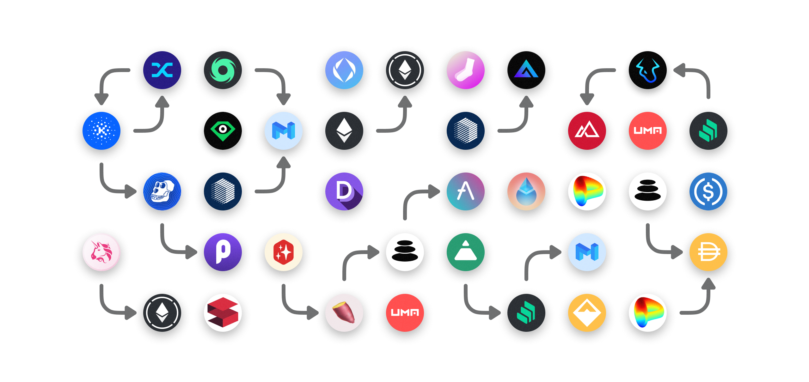

# Rainbow Swaps SDK

[](https://www.npmjs.com/package/@rainbow-me/swaps)
[](https://www.gnu.org/licenses/gpl-3.0)

Swap aggregator SDK used in Rainbow Wallet. Built on [viem](https://viem.sh).

## Installation

```bash
yarn add @rainbow-me/swaps viem
```

```bash
npm install @rainbow-me/swaps viem
```

```bash
pnpm add @rainbow-me/swaps viem
```

> `viem` is a peer dependency — you need it for `PublicClient`, `WalletClient`, and related types.

## Usage

### Get a quote for a pair

```typescript
import { getQuote } from '@rainbow-me/swaps';

const quote = await getQuote({
  source, // optional, "1inch" or "0x"
  chainId, // numeric chain id
  fromAddress, // address of the wallet to execute the swap from
  destReceiver, // optional, address to receive the output tokens
  sellTokenAddress, // address of the input token
  buyTokenAddress, // address of the output token
  sellAmount, // amount of the input token (required if not passing buyAmount)
  buyAmount, // amount of the output token (required if not passing sellAmount)
  slippage, // max slippage percentage allowed
  currency, // price currency ("USD", "ETH", etc.)
});
```

### Estimate gas for the swap

```typescript
import { getQuoteExecutionDetails } from '@rainbow-me/swaps';
import { createPublicClient, http } from 'viem';
import { mainnet } from 'viem/chains';

const publicClient = createPublicClient({
  chain: mainnet,
  transport: http(),
});

const { method, methodArgs, address, abi, methodName, params } =
  getQuoteExecutionDetails(
    quote, // quote returned from getQuote
    { from: quote.from }, // transaction options
    publicClient // viem PublicClient
  );

const estimatedGas = await method();
```

### Execute swap for a given quote

```typescript
import { fillQuote } from '@rainbow-me/swaps';
import { createWalletClient, custom } from 'viem';
import { mainnet } from 'viem/chains';

const walletClient = createWalletClient({
  chain: mainnet,
  transport: custom(window.ethereum),
  account: '0x...', // or from useAccount()
});

const txHash = await fillQuote(
  quote, // quote returned from getQuote
  transactionOptions, // gasLimit, maxFeePerGas, maxPriorityFeePerGas, nonce, value, from
  walletClient, // viem WalletClient
  permit, // true if you want to use the permit
  chainId, // numeric chain id
  referrer, // optional referrer string
  publicClient // optional, required when permit=true
);
```

### Prepare fill quote transaction (for batching / EIP-7702)

```typescript
import { prepareFillQuote } from '@rainbow-me/swaps';

const batchCall = await prepareFillQuote(
  quote, // quote returned from getQuote
  transactionOptions, // gasLimit, maxFeePerGas, etc.
  permit, // true if you want to use the permit
  chainId, // numeric chain id
  referrer, // optional referrer string
  publicClient, // optional, required when permit=true
  walletClient // optional, required when permit=true
);

// Returns { to, data, value } — send it however you like
const hash = await walletClient.sendTransaction({
  ...batchCall,
  value: BigInt(batchCall.value),
  account: walletClient.account,
  chain: walletClient.chain,
});
```

## Features

- Token to ETH swaps
- Token to Token swaps
- ETH to Token swaps
- Cross-chain swaps
- Use of permit when supported (to avoid an extra approval)
- Supported chains: Mainnet, Optimism, Arbitrum, Polygon, Base, Zora, and more

## Migrating from ethers

If you're upgrading from a version that used ethers.js, see the [Migration Guide](./MIGRATION.md).

## Development

```bash
yarn install
yarn build        # build with zile
yarn test         # run tests with vitest
yarn typecheck    # type-check src + tests
yarn lint         # lint with oxlint
yarn lint:fix     # lint and auto-fix
yarn format       # format with oxfmt
yarn format:check # check formatting
```

## License

Licensed under the [GPL-3.0 License](../../LICENSE).
